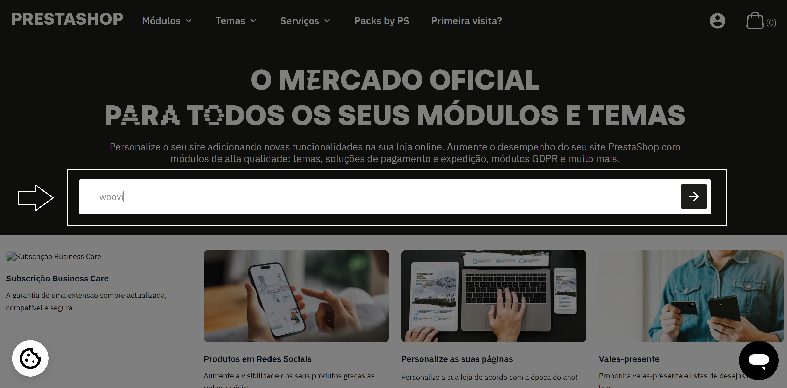
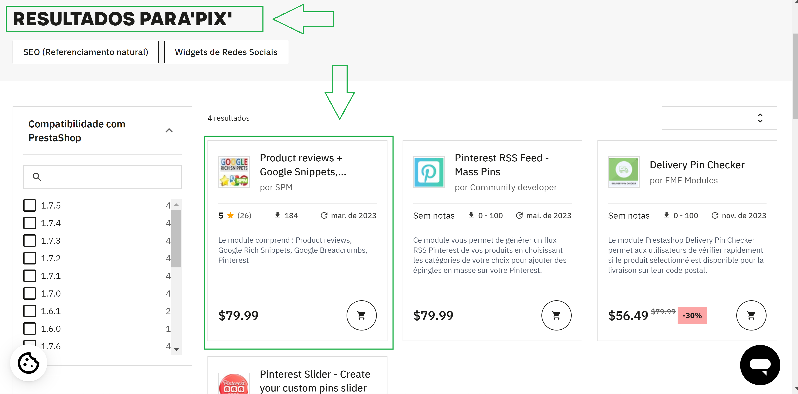

# Getting the plugin

Steps to download woovi's plugin from prestashop addon's marketplace.

## 0. Go to Pretashop addons' market

Copy this url and paste in the brownser
```
https://addons.prestashop.com/
```


## 1. Search for woovi's plugin



## 2. Select the plugin



## 3. Hit the download button


## 4. Follow all downloading steps until the end of it


## 5. Find the downloaded .zip file


## 6. As a loggged user open your prestashop back-office


## 7. After installation click "set up"


## 8. Next follow the setup guide

- For AppID and label set-up do [this](../test-plans/plugin-setup.md)
- For webhook set-up do [this](../test-plans/webhook-setup.md)

