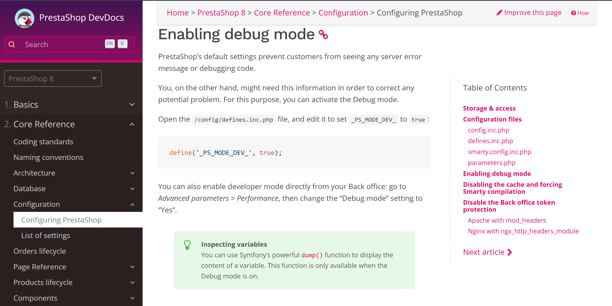

# Debugging

Steps to debug prestashop. 

## 0. Hit the official documentation link

Copy and paste this to the brownser
```
https://devdocs.prestashop-project.org/8/development/configuration/configuring-prestashop/#enabling-debug-mode
```



## Finding logs

There are three places where logs are possible: 

1. Logged directly in the brownser

2. In the brownser console

3. In the following  back-office menu: Advanced Parameters > Logs
